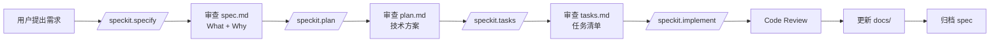

# HomePantry Constitution

> **项目原则** - AI 大模型的永久参考文档

**版本**: 1.0
**创建日期**: 2026-02-15
**最后更新**: 2026-02-15

---

## 1. 产品价值观

### 1.1 核心价值主张

> 让每一个热爱做饭的人，都能轻松管理自己的私房菜谱，从容规划每日餐食

这不是一个复杂的烹饪社交平台，而是一个安静、贴心、极简的个人工具。它就像你厨房里那个永远整洁的食谱架，随时待命，从不打扰。

### 1.2 设计哲学

**简洁至上**
- 减少认知负担，操作不超过 3 步
- 每个功能只做一件事，做好一件事

**温暖亲切**
- 使用温暖配色，柔和圆角
- 像朋友一样帮助，而不是冷冰冰的工具

**高效流畅**
- 快速响应，流畅动画
- 不让用户等待

**清晰反馈**
- 每个操作都有明确反馈
- 让用户知道发生了什么

**容错性强**
- 可撤销，可恢复
- 不让用户担心犯错

---

## 2. 技术原则

### 2.1 架构原则

**MVVM + Clean Architecture**
```
┌─────────────────────────────────┐
│         Presentation            │
│  (Views + ViewModels + Nav)     │
└─────────────┬───────────────────┘
              │
              ▼
┌─────────────────────────────────┐
│          Domain                  │
│  (Use Cases + Repositories)     │
└─────────────┬───────────────────┘
              │
              ▼
┌─────────────────────────────────┐
│           Data                   │
│  (Room + DAOs + Entities)        │
└─────────────────────────────────┘
```

**严格的职责分离**
- **UI 层**: 只负责渲染和用户交互，不包含业务逻辑
- **ViewModel 层**: 管理状态和业务逻辑，协调 Repository
- **Repository 层**: 数据抽象，协调多个数据源
- **DAO 层**: 数据库访问，返回 Flow

**单向数据流**
- UI → ViewModel → Repository → DAO → DB
- Flow/LiveData 从 DB 流向 UI

### 2.2 代码质量

**Kotlin 编码规范**

```kotlin
// 类名使用 PascalCase
class RecipeRepository

// 函数和变量使用 camelCase
fun getRecipeById(): Recipe
val recipeName: String

// 常量使用 UPPER_SNAKE_CASE
const val MAX_RECIPE_NAME_LENGTH = 50
```

**文件组织**
```kotlin
// 1. 文件头注释（可选）
// 2. 包声明
package com.homepantry.data.entity

// 3. 导入语句
import androidx.room.Entity
import androidx.room.PrimaryKey

// 4. 类/接口/对象声明
@Entity(tableName = "recipes")
data class Recipe(...)

// 5. 伴生对象
companion object {
    const val DEFAULT_SERVINGS = 4
}

// 6. 扩展函数
fun Recipe.formattedName(): String { ... }
```

**注释规范**
```kotlin
/**
 * 菜谱实体类
 *
 * @property id 唯一标识符
 * @property name 菜谱名称（2-50字符）
 */
@Entity(tableName = "recipes")
data class Recipe(...)

// 行内注释 - 解释"为什么"而不是"是什么"
val cookingTime = if (recipe.isQuickMeal) {
    15  // 快速菜谱预设较短时间
} else {
    recipe.cookingTime
}
```

### 2.3 测试要求

**测试覆盖率**
- **目标**: ≥ 70%
- **强制**: 所有 Repository 必须有测试
- **强制**: 核心业务逻辑必须有测试
- **推荐**: 关键 UI 路径必须有测试

**测试层级**
```kotlin
// 单元测试
class RecipeRepositoryTest {
    @Test
    fun `getRecipeById returns recipe when exists`() { ... }
}

// 集成测试
class RecipeListScreenTest {
    @get:Rule
    val composeTestRule = createComposeRule()

    @Test
    fun `click on recipe navigates to detail`() { ... }
}
```

### 2.4 性能要求

**性能指标**
- **App 启动时间**: < 2s
- **页面切换时间**: < 1s
- **列表渲染**: 使用 LazyColumn 虚拟化
- **内存占用**: 避免内存泄漏

**性能优化技巧**
```kotlin
// 1. 使用 LazyColumn 虚拟化长列表
LazyColumn {
    items(recipes, key = { it.id }) { recipe ->
        RecipeListItem(recipe)
    }
}

// 2. 避免不必要的重组
@Composable
fun RecipeListItem(recipe: Recipe) {
    val difficultyColor = remember(recipe.difficulty) {
        getDifficultyColor(recipe.difficulty)
    }
    // ...
}

// 3. 使用 Flow 的 flowWithLifecycle
LaunchedEffect(Unit) {
    viewModel.uiState
        .flowWithLifecycle(lifecycle)
        .collect { state ->
            // 处理状态
        }
}
```

### 2.5 安全性要求

**输入验证**
```kotlin
// 所有用户输入必须验证
data class RecipeInput(
    val name: String,
    val cookingTime: Int,
    val servings: Int
) {
    fun validate(): ValidationResult {
        val errors = mutableListOf<String>()

        if (name.length < 2 || name.length > 50) {
            errors.add("菜谱名称长度必须在2-50字符之间")
        }
        if (cookingTime <= 0) {
            errors.add("烹饪时间必须为正数")
        }

        return if (errors.isEmpty()) {
            ValidationResult.Valid
        } else {
            ValidationResult.Invalid(errors)
        }
    }
}
```

**SQL 注入防护**
```kotlin
// Room 使用参数化查询，自动防止 SQL 注入
@Query("SELECT * FROM recipes WHERE name LIKE :searchQuery")
fun searchRecipes(searchQuery: String): Flow<List<Recipe>>

// 使用绑定参数
@Query("SELECT * FROM recipes WHERE id = :recipeId")
fun getRecipeById(recipeId: String): Flow<Recipe?>
```

---

## 3. 数据原则

### 3.1 数据库设计

**规范化设计**
- 避免数据冗余
- 使用外键关联
- 合理的索引设计

**索引优化**
```kotlin
@Dao
interface RecipeDao {
    // 常用查询字段必须有索引
    @Query("SELECT * FROM recipes WHERE categoryId = :categoryId")
    fun getRecipesByCategory(categoryId: String): Flow<List<Recipe>>

    @Query("SELECT * FROM recipes WHERE name LIKE :query")
    fun searchRecipes(query: String): Flow<List<Recipe>>
}

// Entity 索引定义
@Entity(
    tableName = "recipes",
    indices = [
        Index(value = ["categoryId"]),
        Index(value = ["name"]),
        Index(value = ["createdAt"])
    ]
)
data class Recipe(...)
```

**迁移策略**
```kotlin
// 版本升级必须有 Migration
val MIGRATION_2_3 = object : Migration(2, 3) {
    override fun migrate(database: SupportSQLiteDatabase) {
        database.execSQL("ALTER TABLE recipes ADD COLUMN imageUrl TEXT")
    }
}

// 数据库构建器中添加 Migration
Room.databaseBuilder(...)
    .addMigrations(MIGRATION_2_3)
    .fallbackToDestructiveMigration()
    .build()
```

**事务处理**
```kotlin
// 复杂操作使用 @Transaction
@Dao
interface RecipeDao {
    @Transaction
    suspend fun insertRecipeWithDetails(
        recipe: Recipe,
        ingredients: List<RecipeIngredient>,
        instructions: List<RecipeInstruction>
    ) {
        insertRecipe(recipe)
        ingredients.forEach { insertRecipeIngredient(it) }
        instructions.forEach { insertRecipeInstruction(it) }
    }
}
```

### 3.2 数据流

**单向数据流**
```kotlin
// UI → ViewModel → Repository → DAO → DB
// Flow/LiveData 从 DB 流向 UI

class RecipeViewModel(
    private val recipeRepository: RecipeRepository
) : ViewModel() {

    // StateFlow 用于 UI 状态
    private val _uiState = MutableStateFlow<RecipeUiState>(RecipeUiState.Loading)
    val uiState: StateFlow<RecipeUiState> = _uiState.asStateFlow()

    // 用户操作
    fun loadRecipes() {
        viewModelScope.launch {
            _uiState.value = RecipeUiState.Loading
            try {
                recipeRepository.getAllRecipes()
                    .collect { recipes ->
                        _uiState.value = RecipeUiState.Success(recipes)
                    }
            } catch (e: Exception) {
                _uiState.value = RecipeUiState.Error(e.message)
            }
        }
    }
}
```

**Flow 使用**
```kotlin
// 所有数据库查询返回 Flow
@Dao
interface RecipeDao {
    @Query("SELECT * FROM recipes")
    fun getAllRecipes(): Flow<List<Recipe>>
}

// Repository 返回 Flow
class RecipeRepository(...) {
    fun getAllRecipes(): Flow<List<Recipe>> {
        return recipeDao.getAllRecipes()
    }
}

// ViewModel 收集 Flow
fun loadRecipes() {
    viewModelScope.launch {
        recipeRepository.getAllRecipes()
            .collect { recipes ->
                _uiState.value = RecipeUiState.Success(recipes)
            }
    }
}
```

---

## 4. UI/UX 原则

### 4.1 视觉设计

**配色方案**
```kotlin
// 主色调
val WarmOrange = Color(0xFFFF6B35)    // 温暖橙
val CreamWhite = Color(0xFFFAF7F2)    // 米白
val DarkGray = Color(0xFF2C3E50)     // 深灰

// 辅助色
val VegetableGreen = Color(0xFF27AE60)  // 蔬菜绿
val MeatRed = Color(0xFFE74C3C)        // 肉类红
val SeafoodBlue = Color(0xFF3498DB)    // 海鲜蓝
val StapleYellow = Color(0xFFF39C12)   // 主食黄

// 状态色
val SuccessGreen = Color(0xFF27AE60)   // 成功
val WarningYellow = Color(0xFFF39C12) // 警告
val ErrorRed = Color(0xFFE74C3C)      // 错误
val InfoBlue = Color(0xFF3498DB)       // 信息
```

**圆角规范**
```kotlin
val ExtraLargeRoundedCorner = 16.dp   // 大圆角（卡片）
val MediumRoundedCorner = 12.dp       // 中圆角（按钮）
val SmallRoundedCorner = 8.dp        // 小圆角（标签）
val TinyRoundedCorner = 4.dp          // 微圆角（图片）
```

**字体规范**
```kotlin
// 字体大小
val ExtraLargeTitle = 28.sp    // 大标题
val LargeTitle = 24.sp         // 标题
val Title = 20.sp             // 标题
val Subtitle = 18.sp          // 副标题
val Body = 16.sp              // 正文
val Caption = 14.sp           // 辅助文字
val SmallCaption = 12.sp      // 说明文字
```

### 4.2 交互设计

**操作反馈**
```kotlin
// 点击反馈
Modifier.clickable(
    interactionSource = remember { MutableInteractionSource() },
    indication = rememberRipple(bounded = true)
)

// 加载状态
if (isLoading) {
    CircularProgressIndicator()
}

// 错误状态
if (error != null) {
    ErrorScreen(
        message = error,
        onRetry = { /* 重试 */ }
    )
}

// 空状态
if (items.isEmpty()) {
    EmptyStateScreen(
        illustration = R.drawable.empty_state,
        message = "还没有菜谱",
        action = { /* 添加菜谱 */ }
    )
}
```

**手势操作**
```kotlin
// 通用手势
Modifier.clickable { /* 点击 */ }
Modifier.longPressGestureFilter { /* 长按 */ }
Modifier.swipeToDismiss { /* 滑动删除 */ }

// 厨房模式特殊手势
Modifier.pointerInput(Unit) {
    detectDragGestures { _, dragAmount ->
        // 手背滑动切换步骤
    }
}
```

### 4.3 厨房模式特殊设计

**横屏大字**
```kotlin
@Composable
fun CookingModeScreen(
    instruction: RecipeInstruction,
    onNext: () -> Unit,
    onPrevious: () -> Unit
) {
    // 横屏布局
    CompositionLocalProvider(LocalLayoutDirection provides LayoutDirection.Ltr) {
        Column(
            modifier = Modifier
                .fillMaxSize()
                .padding(32.dp),
            verticalArrangement = Arrangement.Center
        ) {
            // 超大字体
            Text(
                text = instruction.instruction,
                fontSize = 36.sp,
                fontWeight = FontWeight.Bold,
                lineHeight = 48.sp
            )

            // 大按钮
            Row(
                horizontalArrangement = Arrangement.spacedBy(32.dp)
            ) {
                Button(
                    onClick = onPrevious,
                    modifier = Modifier.size(80.dp)
                ) {
                    Icon(Icons.Default.ArrowBack, null)
                }
                Button(
                    onClick = onNext,
                    modifier = Modifier.size(80.dp)
                ) {
                    Icon(Icons.Default.ArrowForward, null)
                }
            }
        }
    }
}
```

**语音播报**
```kotlin
class VoicePlaybackManager(
    private val context: Context
) {
    private val tts = TextToSpeech(context) { status ->
        if (status == TextToSpeech.SUCCESS) {
            // 初始化成功
        }
    }

    fun speak(text: String) {
        tts.speak(text, TextToSpeech.QUEUE_ADD, null, null)
    }

    fun stop() {
        tts.stop()
    }
}
```

**手势操作**
```kotlin
@Composable
fun CookingModeGestures(
    onNext: () -> Unit,
    onPrevious: () -> Unit
) {
    Box(
        modifier = Modifier
            .fillMaxSize()
            .pointerInput(Unit) {
                detectDragGestures { _, dragAmount ->
                    if (dragAmount.x > 100) {
                        onPrevious()  // 右滑上一步
                    } else if (dragAmount.x < -100) {
                        onNext()      // 左滑下一步
                    }
                }
            }
    )
}
```

---

## 5. AI 协作指南

### 5.1 AI 角色定义

**AI 的职责**
- **代码生成**: 根据 tasks.md 生成代码
- **规范参考**: 永远参考 constitution.md
- **质量保证**: 生成的代码必须符合测试要求

**AI 不是**
- ❌ 架构决策者
- ❌ 技术栈决定者
- ❌ 产品决策者
- ❌ 最终代码审查者

### 5.2 AI 使用规则

**永远从 Constitution 开始**
```kotlin
// 生成代码前先阅读 constitution.md
// 确保符合所有原则

// 1. 架构原则：MVVM + Clean Architecture
// 2. 代码质量：Kotlin 编码规范
// 3. 测试要求：≥ 70% 覆盖率
// 4. 性能要求：启动时间 < 2s
// 5. 安全性要求：输入验证、SQL 注入防护
```

**遵循 Architecture**
```kotlin
// 严格遵守 MVVM + Clean Architecture
// 不跨越层级直接访问

// ✅ 正确
class RecipeViewModel(
    private val recipeRepository: RecipeRepository
) {
    // ViewModel → Repository
}

// ❌ 错误
class RecipeViewModel(
    private val recipeDao: RecipeDao  // 不应该直接访问 DAO
) {
    // ViewModel → DAO（跨越层级）
}
```

**代码规范**
```kotlin
// 遵循 Kotlin 编码规范
// 类名: PascalCase
// 函数/变量: camelCase
// 常量: UPPER_SNAKE_CASE
// 4 空格缩进
```

**测试优先**
```kotlin
// 生成代码时同时生成测试
// 测试覆盖率 ≥ 70%

@Test
fun `getRecipeById returns recipe when exists`() {
    // Given
    val recipe = Recipe(id = "1", name = "番茄炒蛋")
    dao.insertRecipe(recipe)

    // When
    val result = repository.getRecipeById("1")

    // Then
    assertThat(result).isEqualTo(recipe)
}
```

### 5.3 AI 禁止行为

❌ **不修改 Architecture**
- 不改变 MVVM + Clean Architecture
- 不跨越层级直接访问

❌ **不更改技术栈**
- 不引入未讨论的依赖
- 不改变编程语言（保持 Kotlin）
- 不改变框架（保持 Jetpack Compose + Room）

❌ **不跳过测试**
- 所有新功能必须有测试
- 所有 Bug 修复必须有测试
- 测试覆盖率 ≥ 70%

❌ **不忽略性能**
- 不生成低效代码
- 不忽略性能优化
- App 启动时间 < 2s

---

## 6. 开发流程

### 6.1 新功能开发流程



### 6.2 Bug 修复流程

1. **创建 Bug Spec**
   ```markdown
   ## Bug: 菜谱搜索结果不正确

   ### What
   搜索菜谱时，结果包含不相关的菜谱

   ### Why
   LIKE 查询没有考虑词边界

   ### Reproduce
   1. 搜索 "番茄"
   2. 结果包含 "番茄炒蛋" 和 "番茄牛腩"
   3. 但也包含 "土豆番茄"（应该不包含）
   ```

2. **分析原因**
   ```sql
   -- 问题 SQL
   SELECT * FROM recipes
   WHERE name LIKE '%番茄%'

   -- 正确 SQL
   SELECT * FROM recipes
   WHERE name LIKE '%番茄%'
   OR name LIKE '番茄%'
   OR name LIKE '%番茄'
   ```

3. **编写测试用例**
   ```kotlin
   @Test
   fun `searchRecipes only returns exact matches`() {
       // Given
       dao.insertRecipe(Recipe(id = "1", name = "番茄炒蛋"))
       dao.insertRecipe(Recipe(id = "2", name = "土豆番茄"))

       // When
       val results = dao.searchRecipes("番茄")

       // Then
       assertThat(results).hasSize(1)
       assertThat(results[0].name).isEqualTo("番茄炒蛋")
   }
   ```

4. **修复代码**
   ```kotlin
   @Query("""
       SELECT * FROM recipes
       WHERE name LIKE :query
       ORDER BY createdAt DESC
   """)
   fun searchRecipes(query: String): Flow<List<Recipe>>
   ```

5. **验证测试通过**

### 6.3 重构流程

1. **创建重构 Spec**
   ```markdown
   ## Refactor: 优化菜谱加载性能

   ### What
   优化菜谱列表加载性能

   ### Why
   当前加载 1000 个菜谱需要 3s，超过性能标准（< 2s）

   ### Goals
   - 加载时间 < 2s
   - 保持功能不变
   - 测试通过
   ```

2. **定义重构目标**
   ```kotlin
   // 目标：优化查询性能

   // 当前方案
   @Query("SELECT * FROM recipes")
   fun getAllRecipes(): Flow<List<Recipe>>

   // 优化方案：添加索引和分页
   @Query("SELECT * FROM recipes ORDER BY createdAt DESC LIMIT :limit OFFSET :offset")
   fun getRecipesPaged(limit: Int, offset: Int): Flow<List<Recipe>>
   ```

3. **重构代码**
   ```kotlin
   // 分批加载数据
   fun loadRecipes() {
       viewModelScope.launch {
           var page = 0
           while (true) {
               val recipes = repository.getRecipesPaged(pageSize = 20, page)
               if (recipes.isEmpty()) break
               _uiState.update { it.copy(recipes = it.recipes + recipes) }
               page++
           }
       }
   }
   ```

4. **确保测试通过**
   ```bash
   ./gradlew test
   ./gradlew connectedAndroidTest
   ```

5. **更新文档**

---

## 7. 质量标准

### 7.1 代码质量

**CI 检查**
- [ ] CircleCI / GitHub Actions 检查通过
- [ ] 代码覆盖率 ≥ 70%
- [ ] detekt 静态分析通过
- [ ] Android Lint 检查通过

**代码审查清单**
- [ ] 代码符合 Kotlin 编码规范
- [ ] 添加了必要的注释
- [ ] 包含单元测试
- [ ] 测试覆盖率没有降低
- [ ] 没有引入新的警告
- [ ] 更新了相关文档

### 7.2 文档质量

**Spec 质量标准**
- [ ] 有明确的目标
- [ ] 有清晰的用户场景
- [ ] 有完整的验收标准
- [ ] 与代码同步

**Plan 质量标准**
- [ ] 有技术栈说明
- [ ] 有架构图
- [ ] 有数据模型
- [ ] 有性能考虑

**Tasks 质量标准**
- [ ] 有可执行的步骤
- [ ] 有验证方法
- [ ] 与已实现代码匹配

### 7.3 测试质量

**单元测试**
- [ ] 所有业务逻辑有测试
- [ ] Repository 层有测试
- [ ] ViewModel 层有测试

**集成测试**
- [ ] 关键用户路径有测试
- [ ] 导航流程有测试
- [ ] 数据库操作有测试

**UI 测试**
- [ ] 关键页面有测试
- [ ] 用户交互有测试
- [ ] 状态变化有测试

---

## 8. 持续改进

### 8.1 定期回顾

**每月**: Constitution 更新回顾
- 新增原则是否合理
- 是否需要调整
- 团队反馈收集

**每季度**: 架构回顾
- 架构是否满足需求
- 是否需要重构
- 技术债务评估

**每年**: 技术栈评估
- 技术栈是否需要更新
- 新技术是否引入
- 迁移计划制定

### 8.2 知识管理

**重要决策记录**
- 所有重要决策记录在 research.md
- 包含决策原因、影响、替代方案

**技术选型记录**
- 所有技术选型记录在 plan.md
- 包含选型原因、对比、风险

**经验教训总结**
- 所有经验教训更新 Constitution
- 避免重复错误
- 持续改进

---

## 附录

### A. 参考文档

- [README.md](../README.md)
- [REQUIREMENTS.md](../docs/REQUIREMENTS.md)
- [ARCHITECTURE.md](../docs/ARCHITECTURE.md)
- [DEVELOPMENT.md](../docs/DEVELOPMENT.md)
- [TEST_REPORT.md](../docs/TEST_REPORT.md)

### B. 相关规范

- [Kotlin 编码规范](https://kotlinlang.org/docs/coding-conventions.html)
- [Android 架构指南](https://developer.android.com/topic/architecture)
- [Jetpack Compose 指南](https://developer.android.com/jetpack/compose)
- [Room 数据库指南](https://developer.android.com/training/data-storage/room)

### C. 工具链接

- [Spec-Kit GitHub](https://github.com/github/spec-kit)
- [OpenSpec GitHub](https://github.com/Fission-AI/OpenSpec)
- [Android Studio](https://developer.android.com/studio)
- [Kotlin Playground](https://play.kotlinlang.org/)

### D. 版本历史

| 版本 | 日期 | 更新内容 | 负责人 |
|------|------|----------|--------|
| 1.0 | 2026-02-15 | 初始版本 | Jude 🦞 |

---

**注意**: 本文档是 HomePantry 项目的核心原则文档，AI 大模型在生成代码时必须始终参考本文档。

**最后更新**: 2026-02-15
**下次回顾**: 2026-03-15
